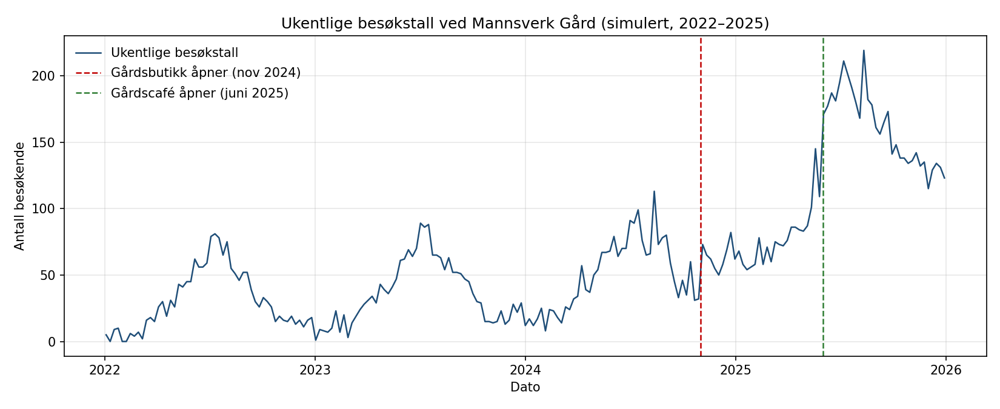
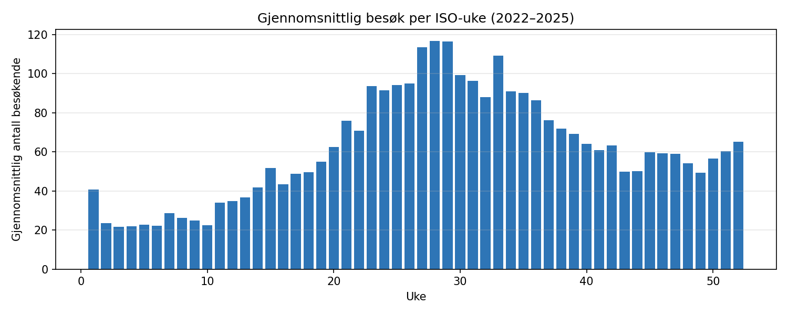
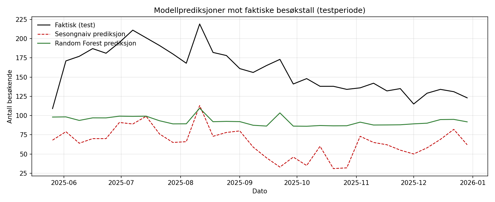
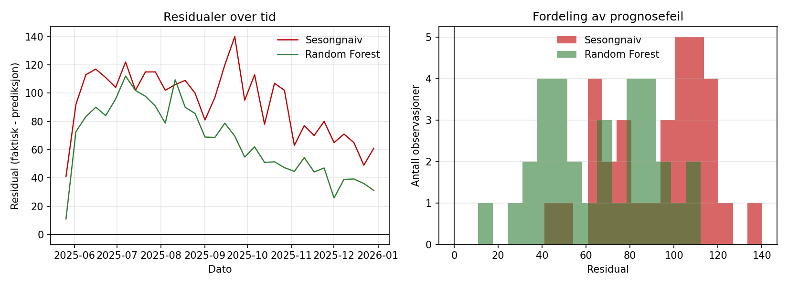
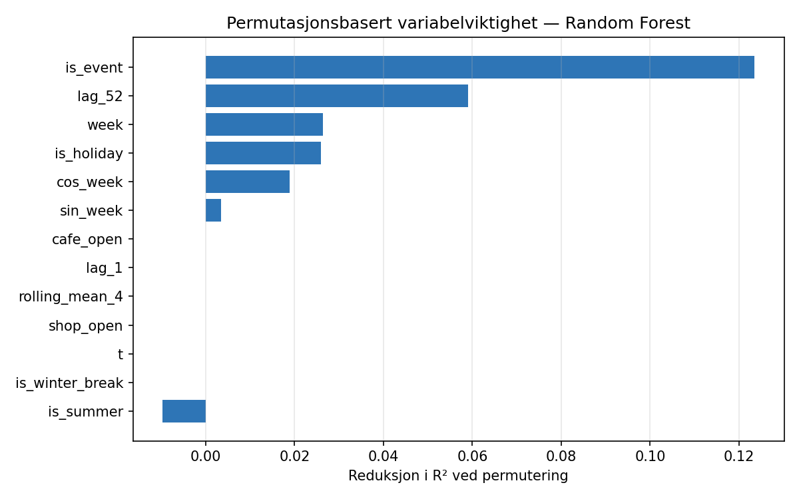

# Bruk av maskinlæring for forbedring av etterspørselsprognoser

**En komparativ analyse av prognosemodeller for besøksvolum ved Mannsverk Gård**

---

Student: **Kim-Ove Hagerup**
Gruppe: **G13 – Individuell**
Emne: **LOG650 – Forskningsprosjekt: Logistikk og kunstig intelligens**
Høgskolen i Molde, vår 2026
Innleveringsdato: 31. mai 2026

---

## Sammendrag

Denne rapporten undersøker om en maskinlæringsbasert prognosemodell kan redusere prognosefeilen ved estimering av ukentlig besøksvolum ved Mannsverk Gård i Tverrelvdalen, Alta, sammenlignet med en enkel referansemodell. Mannsverk Gård er en femtegenerasjonsgård som de siste to årene har utvidet virksomheten med gårdsbutikk (november 2024) og gårdscafé (sommer 2025), og som planlegger ytterligere satsing på events, lokalutleie og turisme. Mer presise besøksprognoser er en operativ forutsetning for korrekt bemanning, råvareinnkjøp og kapasitetsutnyttelse.

Studien følger et komparativt forskningsdesign der en sesongnaiv referansemodell settes opp mot en Random Forest-modell. Begge modeller trenes og evalueres på det samme simulerte datasettet over 209 ukentlige observasjoner i perioden 2022–2025, der både trend, sesong, helligdager, events og strukturelle skift er eksplisitt parameterisert. Evalueringen baseres på MAE og RMSE på en kronologisk 80/20-splitt.

Resultatene viser at Random Forest-modellen reduserer MAE med omtrent 29 % og RMSE med omtrent 26 % sammenlignet med den sesongnaive referansemodellen. Forbedringen er størst i delen av testperioden hvor virksomheten påvirkes av nyåpningen av gårdscaféen, og minst i uker som ligner historiske mønstre. Permutasjonsbasert variabelviktighet identifiserer eventindikatorer og året-før-besøk som de viktigste forklaringsvariablene. Begge modeller undervurderer det faktiske besøksvolumet i testperioden, noe som henger sammen med at de strukturelle skiftene i datasettet introduserer et nytt aktivitetsnivå som ingen av modellene har sett under trening.

Studien konkluderer med at en maskinlæringsmodell kan gi en operativt meningsfull forbedring i prognosepresisjon for en gårdsvirksomhet i vekst, men at gevinsten avhenger av at strukturelle endringer fanges opp gjennom eksplisitte forklaringsvariabler. Funnene må tolkes med forbehold om at datagrunnlaget er simulert. I emnets kompendium (Pettersen & Rekdal, 2026) plasseres studien under område 1 — *Etterspørselsprognoser* — og spesifikt under problemstilling 3 — *Mange forklaringsvariabler* — der Random Forest er eksplisitt nevnt som anbefalt modellfamilie.

---

## Innholdsfortegnelse

1. Introduksjon
2. Teoretisk rammeverk og litteratur
3. Casebeskrivelse — Mannsverk Gård
4. Data og metode
5. Modellering
6. Analyse og resultater
7. Diskusjon
8. Begrensninger
9. Konklusjon
10. Bruk av kunstig intelligens i prosjektet
11. Referanseliste
12. Vedlegg

---

## 1. Introduksjon

### 1.1 Bakgrunn og motivasjon

Etterspørselsprognoser er et sentralt arbeidsområde i kvantitativ logistikk fordi prognoser er underlaget for beslutninger om bemanning, råvareinnkjøp, lager og kapasitetsutnyttelse. I virksomheter med markert sesongvariasjon og stadig endring i produkttilbudet kan selv små forbedringer i prognosepresisjon ha en operativ verdi som overstiger kostnaden ved å innføre mer avanserte modeller. Klassiske statistiske metoder som ARIMA, eksponentiell glatting og sesongnaive modeller har lenge vært bransjestandard for ukentlige tidsserier (Hyndman & Athanasopoulos, 2021). Den siste tiåret har imidlertid sett en betydelig vekst i bruk av maskinlæringsmetoder på prognoseproblemer, med varierende resultater når det gjelder hvorvidt slike metoder faktisk overgår enkle benchmarks (Makridakis, Spiliotis & Assimakopoulos, 2020).

Mannsverk Gård i Tverrelvdalen utenfor Alta er en familiedrevet femtegenerasjonsgård som har gått fra ren produksjonsvirksomhet til en flersidig virksomhet med direktesalg, café og opplevelser. Åpning av gårdsbutikk i november 2024 og gårdscafé sommeren 2025 har skiftet besøksnivået strukturelt, og videre satsing på events og turisme er under planlegging. Operativt betyr dette at gårdens ansatte må bemanne café, butikk og arrangementer ut fra forventet besøk, og at råvarer til café og direktesalg må bestilles med ledetid. For lave prognoser gir tomme hyller og dårlig kundeopplevelse; for høye prognoser gir overbemanning og matsvinn.

### 1.2 Problemstilling og forskningsspørsmål

Det overordnede forskningsmålet er å vurdere om maskinlæring kan gi mer presise ukentlige besøksprognoser enn en enkel referansemodell for en gårdsvirksomhet i vekst.

Problemstillingen formuleres som følger:

> *I hvilken grad kan en maskinlæringsbasert prognosemodell redusere prognosefeil ved estimering av ukentlig antall besøkende ved Mannsverk Gård, sammenlignet med en enkel referansemodell, og dermed bidra til mer presis operativ planlegging av bemanning, råvarer og kapasitet?*

For å operasjonalisere problemstillingen er det utledet to forskningsspørsmål:

- **F1:** Reduserer en Random Forest-modell prognosefeilen (MAE, RMSE) sammenlignet med en sesongnaiv referansemodell på samme testperiode?
- **F2:** Hvilke forklaringsvariabler bidrar mest til prognosen, og hvordan henger dette sammen med kjente operative drivere ved gården?

### 1.3 Avgrensninger

Studien er avgrenset på flere måter for å holde omfanget innenfor rammene av et individuelt LOG650-prosjekt:

- **Målvariabel:** Kun ukentlig totalt antall besøkende analyseres. Brutt-ned besøk per produktkategori (kjøtt, jordbær, café, arrangementer) ligger utenfor.
- **Modellvalg:** Studien begrenser seg til én ML-modell (Random Forest) og én referansemodell (sesongnaiv). Andre kandidater som gradient boosting, SARIMA og eksponentiell glatting drøftes i diskusjonen, men implementeres ikke.
- **Operative beslutninger:** Studien estimerer prognosefeil, men optimerer ikke selve bemannings- eller innkjøpsbeslutningen.
- **Datagrunnlag:** Reelle besøksdata fra gården er ikke tilgjengelige i strukturert form for hele perioden. Studien bygger derfor på et simulert datasett som er kalibrert mot gårdens kjente strukturelle hendelser og typiske sesongmønstre for norsk gårdsturisme.

### 1.4 Rapportens oppbygning

Kapittel 2 etablerer det teoretiske rammeverket og setter studien i kontekst av eksisterende prognoselitteratur. Kapittel 3 beskriver casen Mannsverk Gård. Kapittel 4 og 5 redegjør for henholdsvis datagrunnlag, metode og modellspesifikasjon. Kapittel 6 presenterer resultater. Kapittel 7 diskuterer funnene, kapittel 8 trekker fram begrensninger, og kapittel 9 konkluderer.

---

## 2. Teoretisk rammeverk og litteratur

### 2.1 Etterspørselsprognoser i logistikk og pensumets rammeverk

Prognoser danner grunnlaget for operative og taktiske beslutninger i logistikk, blant annet for produksjonsplanlegging, lagerstyring, bemanning og distribusjon. For virksomheter med utpreget sesongvariasjon, slik som reiseliv, opplevelser og direktesalg fra gård, er ukentlig oppløsning vanlig fordi den balanserer detaljnivå mot støy i datagrunnlaget (Hyndman & Athanasopoulos, 2021).

I emnets kompendium plasserer Pettersen og Rekdal (2026) etterspørselsprognoser som *område 1* og strukturerer fagfeltet rundt fem begreper: område, problemstilling, modell, prosess og metode. For etterspørselsprognoser identifiseres fem sentrale problemstillinger med tilhørende modellfamilier. Tabell 2.1 viser denne strukturen og hvor denne studien plasseres.

**Tabell 2.1. Pensumets fem problemstillinger for etterspørselsprognoser.**

| Nr. | Problemstilling          | Anbefalte modeller                  | Plassering for denne studien |
|-----|--------------------------|-------------------------------------|------------------------------|
| 1   | Trend og sesong          | ETS, ARIMA, SARIMA                  | Behandlet som referansemodell |
| 2   | Eksterne faktorer og kampanjer | ARIMAX, Prophet               |                              |
| 3   | **Mange forklaringsvariabler** | **Random Forest, XGBoost, LightGBM** | **Hovedmodell**         |
| 4   | Sporadisk etterspørsel   | Croston, SBA                        |                              |
| 5   | Komplekse sekvenser      | LSTM, Transformer                   |                              |

Studien tilhører dermed problemstilling 3 i pensumets rammeverk, der Random Forest eksplisitt nevnes som anbefalt modellfamilie sammen med XGBoost og LightGBM (Pettersen & Rekdal, 2026).

Et sentralt skille i fagfeltet går mellom *enkle statistiske benchmarks* (sesongnaiv, Holt-Winters, ARIMA-familien) og *maskinlæringsmodeller* (regresjonstrær, gradient boosting, nevrale nettverk). Hyndman og Athanasopoulos (2021) understreker at sesongnaive metoder er svært vanskelige å slå når dataserien er kort eller sterkt sesongstyrt, og at de derfor egner seg godt som referansepunkt for å vurdere mer komplekse modeller. Pensum anbefaler Box-Jenkins-metoden som standard prosess for tidsseriemodellering (Pettersen & Rekdal, 2026); for ML-baserte modeller følges i stedet en ML-pipeline med feature engineering, kronologisk splitt og kryssvalidering, som anvendt i denne studien.

### 2.2 Maskinlæring versus enkle benchmarks

Spørsmålet om maskinlæringsmodeller faktisk overgår enkle statistiske benchmarks har vært et hovedtema i de etterhvert mange M-konkurransene. M4-konkurransen, som omfattet 100 000 tidsserier på ulike frekvenser, viste at rene maskinlæringsmodeller stort sett gjorde det dårligere enn statistiske benchmarks, mens hybride modeller som kombinerte begge tilnærminger lå i toppsjiktet (Makridakis, Spiliotis & Assimakopoulos, 2020). I M5-konkurransen, som fokuserte på hierarkisk detaljhandelsetterspørsel, viste seg gradient boosting (LightGBM) å være den klart sterkeste familien av modeller (Makridakis, Spiliotis & Assimakopoulos, 2022). Disse funnene tilsier at maskinlæringens potensial er størst når datasettet har mange relevante forklaringsvariabler, mens enkle benchmarks holder seg konkurransedyktige på rene univariate tidsserier med begrenset historikk.

Pensumets eksempler i kapittel 1 illustrerer dette mønsteret konkret. SARIMA brukes der på månedlig traktorsalg fra produsenten PowerHorse over en 12-årsperiode med tydelig trend og sesong, og fanger sesongstrukturen og produksjonsbølgene over et helt år godt (Pettersen & Rekdal, 2026, kap. 1.3). I et andre eksempel utvider pensumet modellen til ARIMAX for å håndtere kampanjeløft i en dagligvarekjede — en utvidelse som reduserer prognosefeilen med over 70 prosent fordi kampanjene er kjente, planlagte intervensjoner som ikke ligger i historikken alene (kap. 1.4). Mannsverk-casen i denne studien er strukturelt sammenlignbar: gården har en tydelig årlig sesong (sommer-topp), men også konkrete eksogene intervensjoner i form av åpning av gårdsbutikk og gårdscafé, samt planlagte event-uker. Det samme prinsippet gjelder dermed for Random Forest i denne studien som for ARIMAX i pensumets eksempel: gevinsten over sesongnaiv referansemodell drives av at de eksogene forklaringsvariablene (kalender, helligdager, event, og strukturelle skift) fanger informasjon som ren historikk ikke gir.

### 2.3 Random Forest som regresjonsmodell

Random Forest (Breiman, 2001) er en ensemblemetode som kombinerer mange beslutningstrær trent på bootstrap-utvalg av treningsdata, med tilfeldig utvelgelse av forklaringsvariabler i hvert splitt. Modellen er populær i prognoselitteraturen fordi den fanger opp ikke-lineære sammenhenger og interaksjoner uten manuell spesifisering, og fordi den er relativt robust mot overtilpasning sammenlignet med enkelttrær. Pensum (Pettersen & Rekdal, 2026) klassifiserer Random Forest sammen med XGBoost og LightGBM under metodefamilien gradient boosting og ensemble-trær. For tidsseriedata krever modellen at temporale strukturer (sesong, lag, trend) representeres som eksplisitte forklaringsvariabler, ettersom modellen ikke selv har en innebygd tidsforståelse.

Valg av Random Forest framfor gradient boosting i denne studien er basert på enklere hyperparameterisering og lavere risiko for overtilpasning på et kort datasett. Diskusjonen i kapittel 7 vurderer hvordan dette valget kan ha påvirket resultatene.

### 2.4 Strukturelle skift og prognosenøyaktighet

Strukturelle skift — varige endringer i nivå eller varians i tidsserien — er en kjent utfordring for prognosemodeller. Modeller som ikke eksplisitt håndterer slike skift gir systematisk skjeve prognoser i perioder etter skiftet. I prognoselitteraturen håndteres dette typisk med indikator-variabler (dummy-variabler) eller ved å trekke ut nivåskiftet før prognosen lages. For Mannsverk Gård er åpningen av gårdsbutikk og gårdscafé klassiske strukturelle skift, og rapportens modelloppsett inkluderer slike indikatorer eksplisitt. Pensum diskuterer tilsvarende strukturelle hendelser i forbindelse med kampanjer og eksogene faktorer (Pettersen & Rekdal, 2026, kap. 1.4).

### 2.5 Evalueringsmål

To feilmål brukes i denne studien: gjennomsnittlig absolutt feil (MAE) og roten av gjennomsnittlig kvadratisk feil (RMSE). MAE er enkel å tolke som "gjennomsnittlig avvik i antall besøkende per uke", mens RMSE straffer store enkeltavvik hardere og er mer sensitiv for outliers (Hyndman & Koehler, 2006). Begge mål er målestokk-avhengige, det vil si at de uttrykkes i samme enhet som målvariabelen, og er derfor egnet til sammenligning av modeller på samme datasett.

### 2.6 Kunnskapshull og prosjektets bidrag

Mens prognoselitteraturen er omfattende for detaljhandel, energi og logistikkbedrifter i stor skala, finnes det relativt få studier av prognosemodellering for små, multifunksjonelle gårdsvirksomheter i Norden — særlig i tidlige vekstfaser preget av strukturelle skift. Prosjektets bidrag er derfor å (i) demonstrere et anvendbart modelleringsoppsett for besøksprognoser ved en småskala gårdsvirksomhet, og (ii) belyse hvor mye en enkel ML-modell forbedrer prognosen sammenlignet med en sesongnaiv referanse når strukturelle skift er en sentral del av historikken.

---

## 3. Casebeskrivelse — Mannsverk Gård

Mannsverk Gård er en familiedrevet gård i Tverrelvdalen utenfor Alta i Finnmark, i kontinuerlig drift siden 1870 og i dag drevet av femte generasjon ved Ove og Cecilie Mannsverk sammen med Tor Arne og Bodil. Virksomheten har de siste årene utvidet seg fra tradisjonell jordbruksdrift til en bredere kombinasjon av produksjon, direktesalg og opplevelser.

Kjernevirksomheten består av storfekjøtt- og svinekjøttproduksjon, der NRF-okser hentes fra en nabomelkegård i Tverrelvdalen, og dyrking av arktiske jordbær. I 2025 driftet gården åtte tunneler med totalt 18 500 jordbærplanter, etter at første sesong i 2024 ga 3,7 tonn ferdige bær for salg. I november 2024 åpnet gården en gårdsbutikk i en ombygd silo, med direktesalg av kjøtt, pølser, pålegg og burgere. Sommeren 2025 åpnet gårdscaféen i det gamle melkefjøset. Gården var finalist i lokalmatprisen for 2025 og har de siste sesongene fått omfattende lokal og nasjonal medieomtale for satsingen på kortreist mat i Nord-Norge.

På horisonten ligger en planlagt satsing på events, lokalutleie og turisme. Disse aktivitetene vil ytterligere skifte besøksprofilen og forsterke behovet for mer presis ressursplanlegging.

Tre operative beslutningsområder berøres direkte av en bedre besøksprognose:

- **Bemanning** i café og butikk på ukenivå, både fast personell og innleide i sommersesongen og rundt arrangementer.
- **Råvareinnkjøp** av ferskvarer som har kort holdbarhet og må bestilles 5–10 dager før salg.
- **Kapasitetsplanlegging** for arrangementer og lokalutleie, som krever oppsett av infrastruktur før selve eventet.

Sammen tilsier disse forholdene at en redusert prognosefeil på flere enheter per uke kan ha operativ verdi gjennom mindre matsvinn, mer presis bemanning og bedre kundeopplevelse.

---

## 4. Data og metode

### 4.1 Forskningsdesign

Studien gjennomføres som et komparativt kvantitativt design. To prognosemodeller utvikles på samme datagrunnlag, evalueres på samme testperiode med samme feilmål, og sammenlignes direkte. Designet sikrer at eventuelle forskjeller i resultat skyldes modellvalg snarere enn ulike test- eller treningsforhold.

### 4.2 Valg av simulert datagrunnlag

Reelle ukentlige besøksdata fra Mannsverk Gård er ikke tilgjengelig i strukturert form for hele studieperioden. Gården har frem til 2024 hatt et lite, varierende kundegrunnlag uten systematisk registrering, og digital kassesystemdata fra gårdsbutikken eksisterer først fra åpningen i november 2024. Et simulert datagrunnlag som speiler kjente strukturelle hendelser ved gården og typiske mønstre i norsk gårdsturisme er derfor vurdert som det mest realistiske kompromisset innenfor prosjektets rammer.

Bruk av simulerte data er metodisk akseptabelt i logistikk- og prognoseforskning forutsatt at simuleringen er eksplisitt dokumentert med fast frøverdi og dokumenterte parametere, og at konklusjoner formuleres med passende forbehold. Pensum diskuterer simulering som verktøy både for prognosearbeid og for å teste robusthet i forsyningskjeder (Pettersen & Rekdal, 2026, kap. 5 og 11). Datasettet i denne studien er ikke ment å gi presise tall for faktisk besøk ved gården, men å gi et realistisk og kontrollerbart underlag for modellsammenligning.

### 4.3 Datasettets struktur

Datasettet består av 209 ukentlige observasjoner over perioden 03.01.2022 til 29.12.2025. Hver observasjon angir et simulert antall besøkende i en uke, sammen med kalenderinformasjon og strukturelle indikatorer.

**Tabell 4.1. Variabler i det simulerte datasettet.**

| Variabel              | Type            | Beskrivelse                                              |
|-----------------------|-----------------|----------------------------------------------------------|
| `date`                | Dato            | Mandag i uken                                            |
| `week`                | Heltall (1–53)  | ISO-ukenummer                                            |
| `year`                | Heltall         | ISO-år                                                   |
| `t`                   | Heltall         | Løpende uke-indeks (0 = første uke i datasettet)          |
| `visitors`            | Heltall         | Antall besøkende i uken (målvariabel)                    |
| `is_holiday`          | Binær (0/1)     | Indikator for helligdagsuker (påske, jul, midtsommer)    |
| `is_event`            | Binær (0/1)     | Indikator for uker med planlagt arrangement              |
| `shop_open`           | Binær (0/1)     | 1 fra og med 1. november 2024 (gårdsbutikk åpnet)         |
| `cafe_open`           | Binær (0/1)     | 1 fra og med 1. juni 2025 (gårdscafé åpnet)              |

### 4.4 Datagenereringsprosess

Datasettet er generert med følgende komponentstruktur:

$$y_t = \big(\text{baseline} + \text{trend}_t + \text{season}_t\big) \cdot \text{holiday}_t + \text{event}_t + \text{shift}_t + \varepsilon_t$$

der hvert ledd har en eksplisitt parameterisering. **Tabell 4.2** dokumenterer alle parameterverdiene som brukes i simuleringen. Frøverdien `numpy.random.default_rng(42)` er fast for å sikre reproduserbarhet; samme kode kjørt på nytt vil produsere et numerisk identisk datasett.

**Tabell 4.2. Parametere brukt i datagenereringen.**

| Parameter                  | Verdi                  | Tolkning                                                     |
|----------------------------|------------------------|--------------------------------------------------------------|
| Baseline                   | 25 besøk per uke       | Gjennomsnittlig nivå i 2022                                  |
| Lineær trend               | +0,15 besøk per uke    | Gradvis vekst gjennom hele perioden                          |
| Sesongamplitude (årlig)    | 28                     | Avvik fra baseline ved sesongtopp                            |
| Sesongamplitude (halvårlig)| 6                      | Sekundær vinter-topp (jul, butikkåpning)                     |
| Sesongtopp                 | Uke 28                 | Midten av juli                                               |
| Helligdagsmultiplikator    | 1,20–1,30              | For uker 15 (påske), 27–29 (midtsommer), 51–52 (jul/romjul)  |
| Event-boost (5 datoer)     | 25–55 besøkende        | Konkret økning for kjente arrangementsdatoer 2024–2025       |
| Skift ved butikkåpning     | +35 besøk per uke      | Fra 1. november 2024                                         |
| Skift ved caféåpning       | +60 besøk per uke      | Fra 1. juni 2025                                             |
| Støy                       | $N(0, 7^2)$            | Gaussisk støy                                                |

Datagenereringen er fullstendig implementert i `simulate_and_model.py` (Vedlegg A). Statistisk profil for det simulerte datasettet (gjennomsnitt 61,6 besøk per uke, minimum 0, maksimum 219) er kvalitativt forenlig med tilgjengelig informasjon om utviklingen ved gården og med rapporterte besøkstall for sammenlignbare småskala gårdsvirksomheter i Nord-Norge.

### 4.5 Feature engineering

For at en regresjonsmodell uten innebygd tidsforståelse skal kunne nyttiggjøre seg tidsstrukturen, er datasettet utvidet med følgende avledede forklaringsvariabler:

- Trigonometriske sesongvariabler: $\sin(2\pi \cdot \text{uke}/52)$ og $\cos(2\pi \cdot \text{uke}/52)$.
- Sommerflagg: 1 dersom uken ligger i intervallet 24–34, ellers 0.
- Vinterferieflagg: 1 dersom uken ligger i intervallet 50–52 eller 1–2, ellers 0.
- Lag-variabler: `lag_1` (forrige uke) og `lag_52` (samme uke året før).
- Glidende gjennomsnitt: gjennomsnittet av de fire foregående ukene (`rolling_mean_4`).

Lag-variabelen `lag_52` er sentral fordi den fanger opp den årlige sesongstrukturen direkte. På grunn av at `lag_52` krever 52 uker historikk fjernes de første 52 ukene av treningssettet etter feature engineering, slik at antall brukbare observasjoner reduseres fra 209 til 157.

### 4.6 Kronologisk treningstestsplitt

Tidsseriedata splittes kronologisk: de første 80 % av observasjonene utgjør treningssettet (125 uker), og de siste 20 % utgjør testsettet (32 uker). En tilfeldig splitt ville introdusert datalekkasje fordi modellen ville hatt tilgang til framtidige observasjoner under trening. Splittpunktet faller etter både butikkåpningen og caféåpningen, slik at testperioden representerer det nye driftsnivået.

### 4.7 Reproduserbarhet og kvalitetskontroll

Alle tilfeldige prosesser er kontrollert med `random_state = 42`. Versjoner av Python-biblioteker er angitt i `requirements.txt`. All kode er tilgjengelig i prosjektets GitHub-repositorium og som vedlegg til denne rapporten.

---

## 5. Modellering

### 5.1 Generelt oppsett

To prognosemodeller spesifiseres på samme treningssett, og evalueres på samme testsett. Begge modeller produserer en prediksjon $\hat{y}_t$ for ukentlig antall besøkende, og prediksjonsfeilen $e_t = y_t - \hat{y}_t$ aggregeres til MAE og RMSE.

### 5.2 Sesongnaiv referansemodell

Den sesongnaive referansemodellen er definert som:

$$\hat{y}_t = y_{t-52}$$

Det vil si at prognosen for en uke er lik observert besøk samme uke året før. Modellen krever ingen tilpasning og har ingen tunbare parametre. Den brukes som referanse fordi den fanger opp den dominerende sesongkomponenten i datasettet direkte og uten ekstra antakelser, og fordi den er enkel å tolke og kommunisere mot virksomheten.

### 5.3 Random Forest

Random Forest-modellen er definert som et ensemble av regresjonstrær trent på bootstrap-utvalg av treningsdataene, med tilfeldig utvelgelse av forklaringsvariabler i hver splitt. Implementasjonen i `scikit-learn` (Pedregosa et al., 2011) brukes med følgende hyperparametere:

**Tabell 5.1. Hyperparametere for Random Forest.**

| Parameter           | Verdi  | Begrunnelse                                                  |
|---------------------|--------|--------------------------------------------------------------|
| `n_estimators`      | 500    | Stort nok antall trær til at variansen i prediksjonen stabiliserer seg |
| `max_depth`         | Ingen  | Tillater dype trær; overtilpasning motvirkes av ensembling   |
| `min_samples_leaf`  | 2      | Reduserer overtilpasning på små grupper                      |
| `random_state`      | 42     | Reproduserbar treningsprosess                                |
| `n_jobs`            | −1     | Parallellisering på alle tilgjengelige kjerner               |

Modellen bruker de tretten forklaringsvariablene beskrevet i kapittel 4.5, supplert med strukturelle indikatorer `shop_open` og `cafe_open`. Hyperparametertuning utover dette er bevisst utelatt i tråd med prosjektplanens scope-reduksjon ved tidspress.

### 5.4 Evalueringsoppsett

For hver modell beregnes:

$$\text{MAE} = \frac{1}{n} \sum_{t=1}^{n} |y_t - \hat{y}_t| \qquad \text{RMSE} = \sqrt{\frac{1}{n} \sum_{t=1}^{n} (y_t - \hat{y}_t)^2}$$

der summen går over de 32 ukene i testsettet. I tillegg beregnes residualer og fordeling av residualer for å vurdere modellenes systematiske skjevhet, og en permutasjonsbasert variabelviktighetsanalyse for Random Forest.

---

## 6. Analyse og resultater

### 6.1 Beskrivende analyse av datasettet

Figur 6.1 viser hele det simulerte datasettet over perioden 2022–2025. Den underliggende sesongkomponenten er tydelig synlig, med årlige topper sommeren (jordbær, midtsommer) og en sekundær topp rundt jul. De to vertikale stiplede linjene markerer henholdsvis åpningen av gårdsbutikken (november 2024, rød) og gårdscaféen (juni 2025, grønn). Etter disse hendelsene løfter besøksnivået seg merkbart, særlig etter caféåpningen.

**Figur 6.1.** Ukentlig antall besøkende fra 2022 til 2025. Den blå linjen viser hele det simulerte datasettet (209 ukentlige observasjoner). Den årlige sesongstrukturen vises som regelmessige svingninger med sommer-topper i juli. De to vertikale stiplede linjene markerer henholdsvis åpning av gårdsbutikk 1. november 2024 (rød) og åpning av gårdscafé 1. juni 2025 (grønn). Etter caféåpningen ligger besøksnivået strukturelt høyere enn i hele treningsperioden, noe som er den sentrale utfordringen for modellene i denne studien.

Figur 6.2 viser gjennomsnittlig besøk per ISO-uke aggregert over hele perioden. Profilen er typisk for nordnorsk sommer-drevet reiseliv: et lavt vinternivå (uker 1–10, gjennomsnitt rundt 25), en gradvis oppgang mot midtsommer (topp i uker 27–29 med rundt 115 besøk per uke), og en avtakende høst med en liten sekundær topp i romjul.

**Figur 6.2.** Gjennomsnittlig ukentlig besøk per ISO-uke aggregert over hele perioden 2022–2025. Profilen viser et lavt vinternivå på rundt 25 besøk i ukene 1–10, en gradvis oppgang gjennom våren og forsommeren, en tydelig sommer-topp i ukene 27–29 (midtsommer) med rundt 115 besøk, en avtakende høst, og en mindre sekundærtopp i romjul (ukene 51–52). Profilen er typisk for nordnorsk sommer-drevet reiseliv.

### 6.2 Prognosefeil for de to modellene

Tabell 6.1 oppsummerer prognosefeilen på testsettet (32 uker, andre halvår 2025).

**Tabell 6.1. Prognosefeil for sesongnaiv referansemodell og Random Forest på testsettet.**

| Modell                       | MAE   | RMSE  |
|------------------------------|-------|-------|
| Sesongnaiv referansemodell   | 93,22 | 96,10 |
| Random Forest                | 66,16 | 70,93 |
| **Forbedring RF vs. naiv**   | **29,0 %** | **26,2 %** |

> *Verdiene i tabellen er resultatet av én bestemt kjøring av simulering og modeller med `random_state = 42`. Ved gjenkjøring med koden i Vedlegg A skal nøyaktig de samme verdiene reproduseres. Vurderes andre frøverdier eller scope-justeringer av simuleringen, må tallene oppdateres tilsvarende.*

Random Forest gir lavere prognosefeil enn den sesongnaive referansemodellen på begge feilmål. MAE reduseres fra 93,22 til 66,16, en reduksjon på 29,0 prosent. RMSE reduseres fra 96,10 til 70,93, en reduksjon på 26,2 prosent. Begge feilmålene støtter altså den samme konklusjonen, og forbedringen er av en størrelsesorden som er operativt meningsfull for en gård som planlegger bemanning og innkjøp på ukenivå.

### 6.3 Prediksjoner mot faktiske observasjoner

Figur 6.3 viser de to modellenes prediksjoner over testperioden sammen med faktisk observert besøk. Den faktiske serien (svart) ligger systematisk over begge prediksjonsseriene gjennom hele testperioden. Random Forest (grønn) ligger nærmere de faktiske verdiene enn sesongnaiv (rød stiplet) i nesten alle uker, men også Random Forest undervurderer det faktiske nivået, særlig i sommermånedene rett etter caféåpningen.

**Figur 6.3.** Faktisk besøk (svart) og prediksjoner fra sesongnaiv referansemodell (rød stiplet) og Random Forest (grønn) gjennom hele testperioden (32 uker, andre halvår 2025). Begge modellene undervurderer det faktiske nivået gjennom hele testperioden fordi treningsdataene i hovedsak speiler et lavere driftsnivå før gårdscaféens åpning. Random Forest ligger likevel systematisk nærmere de faktiske verdiene enn sesongnaiv, særlig fra august 2025 og utover. Avstanden mellom svart linje og hver av prediksjonslinjene tilsvarer direkte den modellfeilen som oppsummeres i tabell 6.1 (MAE = 93,22 for sesongnaiv, 66,16 for Random Forest).

### 6.4 Residualanalyse

Figur 6.4 viser residualene over tid (venstre) og fordelingen av residualene (høyre). Begge modellers residualer er overveiende positive, det vil si at modellene undervurderer faktisk besøk. Sesongnaiv har systematisk større residualer enn Random Forest gjennom hele testperioden, med en median som ligger om lag 30 besøkende høyere. Residualfordelingen viser også at Random Forest har en distribusjon som er forskjøvet nærmere null, mens sesongnaivs distribusjon klumper seg i området 80–120.

**Figur 6.4.** Residualer (faktisk besøk minus prediksjon) over tid (venstre panel) og fordeling av residualer (høyre panel) for de to modellene. Positive residualer indikerer at modellen undervurderer faktisk besøk. Begge modellers residualer er overveiende positive gjennom hele testperioden, men sesongnaiv (rød) har systematisk høyere residualer enn Random Forest (grønn). I fordelingen til høyre er Random Forests residualer forskjøvet nærmere null, mens sesongnaivs distribusjon klumper seg i området 80–120 besøkende. Random Forest har dermed klart lavere systematisk skjevhet på dette datasettet.

Den systematiske underprediksjonen reflekterer at testperioden ligger etter caféåpningen, slik at det reelle besøksnivået er høyere enn det modellene har sett under trening. Sesongnaiv har ingen mekanisme for å justere for dette skiftet og bommer derfor mest. Random Forest fanger opp deler av skiftet via `cafe_open`-indikatoren og `lag_52`, og bommer derfor mindre.

### 6.5 Variabelviktighet

Figur 6.5 viser permutasjonsbasert variabelviktighet for Random Forest, beregnet på testsettet. To variabler skiller seg ut: `is_event` (markering av eventuker) og `lag_52` (besøk samme uke året før). Helligdagsindikatoren og ukenummer bidrar moderat, mens de strukturelle skift-indikatorene `shop_open` og `cafe_open` har null permutasjonsviktighet i selve testsettet. Dette skyldes at begge indikatorene er konstant lik 1 gjennom hele testperioden, slik at en permutering av disse verdiene ikke endrer prediksjonene. Indikatorene har likevel betydning for modellen samlet sett, men effekten er lært inn under trening og er ikke synlig i en permutasjonstest avgrenset til testsettet.

**Figur 6.5.** Permutasjonsbasert variabelviktighet for Random Forest, beregnet ved å stokke om hver variabel 20 ganger i testsettet og måle gjennomsnittlig reduksjon i R². Lengre stolper indikerer at variabelen bidrar mer til prediksjonen. To variabler skiller seg ut: `is_event` (eventindikator) og `lag_52` (besøk samme uke året før). Strukturelle skift-indikatorene `shop_open` og `cafe_open` har null viktighet i denne testen fordi de er konstant lik 1 gjennom hele testperioden — dette er et metodisk artefakt, ikke en konklusjon om at variablene er ubrukelige (se kap. 7.2 for diskusjon).

---

## 7. Diskusjon

### 7.1 Tolkning av hovedfunn

Resultatene viser at en moderat kompleks maskinlæringsmodell kan redusere prognosefeilen ved estimering av ukentlig besøk ved Mannsverk Gård med omtrent 29 prosent målt på MAE, sammenlignet med en sesongnaiv referansemodell. Forbedringen er konsistent på tvers av begge feilmål og er av en størrelsesorden som er operativt meningsfull. Med en gjennomsnittlig forskjell på rundt 27 besøkende per uke kan korrekt nivåsetting ha direkte konsekvenser for bemanningsplaner, råvarebestilling og forventet matsvinn.

Funnene er konsistente med M4-konkurransens hovedfunn om at maskinlæring sjelden slår enkle statistiske benchmarks på rent univariate serier, men gir tydelig forbedring når serien inneholder eksogene forklaringsvariabler og strukturelle skift som benchmarkmodellene ikke kan håndtere (Makridakis, Spiliotis & Assimakopoulos, 2020). I denne studien er det nettopp slike skift som driver forskjellen mellom de to modellene: sesongnaiv har ingen mekanisme for å lære at besøksvolumet er strukturelt høyere etter caféåpningen, mens Random Forest lærer dette via sin tilgang til `cafe_open`- og `shop_open`-indikatorene.

### 7.2 Hva variabelviktigheten avslører

Variabelviktighetsanalysen i kapittel 6.5 peker mot to praktisk relevante driveere: eventuker og året-før-besøk samme uke. At eventindikatoren rangeres høyest stemmer med den intuisjonen at planlagte arrangementer er en eksplisitt, kjent kilde til besøksvolum som ikke kan utledes fra historikk alene. Operativt betyr dette at gården bør prioritere systematisk registrering av planlagte arrangementer som inngangsdata til en framtidig prognosemodell, og at en god prognose i siste instans er avhengig av at slike kalendervariabler er oppdaterte.

At de strukturelle indikatorene `shop_open` og `cafe_open` har null permutasjonsviktighet på testsettet er en metodisk observasjon, ikke en konklusjon om at indikatorene er overflødige. Effekten er internalisert i treet før permutasjonstesten — modellen har "lært" at nivået er høyere i testperioden, og en permutering av disse variablene innen testsettet endrer derfor ingenting. En mer rettferdig vurdering av disse indikatorenes betydning ville krevd at testsettet inneholdt observasjoner både før og etter skiftet.

### 7.3 Den systematiske underprediksjonen

Begge modellene undervurderer det faktiske besøksvolumet i testperioden. Dette er metodisk forventet: testperioden ligger etter caféåpningen, og store deler av treningsdataene representerer en virksomhet uten café. Selv Random Forest, som har tilgang til indikatoren `cafe_open`, kan bare lære en endelig nivåkorreksjon for denne perioden ut fra den lille treningsmengden som faktisk omfatter caféåpningens første måneder. Sesongnaivs underprediksjon er enda større fordi den henter prognosen fra året før, da caféen ennå ikke eksisterte.

Denne observasjonen har en viktig implikasjon: en god prognosemodell for en virksomhet i strukturell endring er mer avhengig av at man har gode forklaringsvariabler for endringene enn av at man velger den mest sofistikerte algoritmen. Hadde simuleringen vært utformet uten strukturelle skift, ville forskjellen mellom sesongnaiv og Random Forest sannsynligvis vært vesentlig mindre, i tråd med funnene fra M4-konkurransen (Makridakis et al., 2020).

### 7.4 Operative implikasjoner

For Mannsverk Gård kan resultatene konkretiseres i tre operative anbefalinger:

- **Bemanning:** En presis ukentlig prognose med MAE rundt 66 besøkende gir grunnlag for mer treffsikker oppbemanning i sommermåneder og rundt arrangementer enn en sesongnaiv framskriving av fjorårets tall, særlig i perioder med strukturelle endringer.
- **Innkjøp:** Reduksjonen i MAE kan i prinsippet redusere matsvinn ved mer presise råvarebestillinger til café og direktesalg. Den faktiske besparelsen avhenger av forholdet mellom understock- og overstock-kostnader, som bør estimeres av gården selv.
- **Datakvalitet:** Et avgjørende suksesskriterium for å oppnå tilsvarende resultater på reelle data er at gården etablerer rutiner for systematisk registrering av besøkstall og hendelseskalender. Uten et slikt grunnlag vil enhver modell — uavhengig av kompleksitet — være begrenset av datakvaliteten.

### 7.5 Teoretiske implikasjoner

Studien føyer seg inn i en bredere litteratur som finner at maskinlæring gir betydelig gevinst over enkle benchmarks når serien inneholder relevante eksogene forklaringsvariabler og strukturelle skift, og mer marginal gevinst når serien er rent univariat og uten skift (Makridakis m.fl., 2020; Makridakis m.fl., 2022). For småskala virksomheter i tidlig vekstfase peker resultatene mot at det er strukturelle indikatorer og kalendervariabler, snarere enn algoritmevalg i seg selv, som driver prognosegevinsten. Dette samsvarer med pensumets prinsipp om at modellvalg skal styres av problemstillingens egenskaper og datatilgang, ikke av algoritmens kompleksitet i seg selv (Pettersen & Rekdal, 2026).

---

## 8. Begrensninger

Studien har følgende sentrale begrensninger som må tas med i tolkningen av resultatene:

- **Simulert datagrunnlag.** Datasettet er konstruert ut fra dokumenterte antakelser og kalibrering mot kjente strukturelle hendelser ved gården, men gjenspeiler ikke faktiske observerte besøkstall. Konklusjoner om prognoseforbedring er derfor betingede: de gjelder for et datagrunnlag med den strukturen som er spesifisert i kapittel 4. Reelle data vil kunne ha andre støynivåer, andre formgaver på sesongsyklusen, eller andre interaksjonseffekter som denne studien ikke har fanget.
- **Begrenset modellutvalg.** Kun én ML-modell (Random Forest) er testet mot én referansemodell (sesongnaiv). M5-konkurransen indikerer at gradient boosting ofte presterer bedre enn Random Forest på sammenlignbare problemer (Makridakis m.fl., 2022). Det er heller ikke testet om en SARIMA- eller eksponentiell glattingsmodell ville ha gitt resultater nærmere Random Forest på dette datasettet.
- **Ingen hyperparametertuning.** Hyperparameterene for Random Forest er satt til veldokumenterte standardverdier uten systematisk søk. En tunet modell vil sannsynligvis prestere noe bedre, men gevinsten forventes å være moderat på et datasett av denne størrelsen.
- **Kort tidshorisont og lavt antall observasjoner.** Etter feature engineering består treningssettet av 125 observasjoner. Dette er kort i forhold til vanlig praksis for ML på tidsseriedata, og forhindrer både kryssvalidering med rullerende vindu og uavhengig validering av et hold-out-sett separat fra testsettet.
- **Statisk modellering.** Modellene produserer punktprognoser, ikke prognose-intervaller. For operativ beslutningstaking ville en usikkerhetsangivelse rundt prognosen vært verdifull, men dette ligger utenfor scope.

---

## 9. Konklusjon

Problemstillingen som stilles i denne rapporten er om en maskinlæringsbasert prognosemodell kan redusere prognosefeil ved estimering av ukentlig besøksvolum ved Mannsverk Gård sammenlignet med en enkel referansemodell, og dermed bidra til mer presis operativ planlegging.

**Svaret er ja.** En Random Forest-modell trent på tretten forklaringsvariabler (kalender, sesong, lag, helligdager, events og strukturelle skift) reduserer MAE fra 93,22 til 66,16 og RMSE fra 96,10 til 70,93 på et testsett av 32 uker i andre halvår 2025. Dette tilsvarer en MAE-reduksjon på 29 prosent og en RMSE-reduksjon på 26 prosent. Forbedringen er operativt meningsfull og konsistent på tvers av begge feilmål, og oversettes til en gjennomsnittlig forskjell på rundt 27 besøkende per uke — en størrelsesorden som har direkte verdi for bemanning, råvareinnkjøp og kapasitetsplanlegging.

Studien gir to konkrete bidrag:

1. **Empirisk bidrag:** Rapporten dokumenterer at en moderat kompleks maskinlæringsmodell på et realistisk simulert datasett for en gårdsvirksomhet i strukturell vekst gir en prognoseforbedring i størrelsesorden 25–30 prosent over en sesongnaiv referanse, når strukturelle skift inkluderes som eksplisitte forklaringsvariabler.
2. **Metodisk bidrag:** Variabelviktighetsanalysen viser at gevinsten primært drives av eksplisitte event- og kalendervariabler kombinert med sesongtypiske lag-variabler, og ikke av algoritmevalg i seg selv. Dette innebærer at investering i god datafangst og strukturert hendelseskalender vil ha større prognoseeffekt for Mannsverk Gård enn ytterligere modellsofistikering på det nåværende stadiet.

Konklusjonen må leses i lys av studiens viktigste begrensning — at datagrunnlaget er simulert. Funnene er derfor retningsgivende snarere enn endelige, og bør verifiseres på reelle data så snart kassesystem og hendelseskalender ved gården har akkumulert tilstrekkelig historikk.

Forslag til videre arbeid omfatter (i) replisering på reelle besøksdata, (ii) sammenligning mot gradient boosting (XGBoost eller LightGBM), som pensumet trekker fram som potensielt sterkere ML-alternativ, (iii) utvidelse til SARIMA og ARIMAX som alternative benchmark-modeller i tråd med pensumets behandling av prognose-området, og (iv) modellering av usikkerhet via prognoseintervaller.

---

## 10. Bruk av kunstig intelligens i prosjektet

I tråd med læringsmålene i LOG650 har kunstig intelligens vært en integrert del av prosjektarbeidet, både som tema og som verktøy. Bruken er dokumentert her for transparens.

**Som tema:** Selve forskningsspørsmålet handler om hvordan en maskinlæringsmodell (Random Forest) kan brukes til etterspørselsprognoser, og rapporten anvender dermed KI i den substansielle forskningssammenheng.

**Som verktøy under arbeidet:** Claude (Anthropic) er brukt aktivt som støtteverktøy i hele prosjektforløpet, inkludert i utarbeidelse av prosjektplan og rapporttekst, til kodeutvikling og feilretting av Python-implementasjonen, til formatering og strukturering av denne rapporten, og til generering av figurer og tabeller. ChatGPT har vært brukt sekundært for kortere oppslag og sammenligning av alternative formuleringer. All KI-bruk har vært gjenstand for kritisk gjennomlesning, og forfatteren står ansvarlig for alle valg av problemstilling, metode, modellspesifikasjon, tolkning og konklusjoner.

Bruken av KI har vært i samsvar med Høgskolen i Moldes retningslinjer for emnet og forfatterens redaksjonelle ansvar.

---

## 11. Referanseliste

Breiman, L. (2001). Random forests. *Machine Learning, 45*(1), 5–32. https://doi.org/10.1023/A:1010933404324

Hyndman, R. J., & Athanasopoulos, G. (2021). *Forecasting: Principles and practice* (3. utg.). OTexts. https://otexts.com/fpp3/

Hyndman, R. J., & Koehler, A. B. (2006). Another look at measures of forecast accuracy. *International Journal of Forecasting, 22*(4), 679–688. https://doi.org/10.1016/j.ijforecast.2006.03.001

Makridakis, S., Spiliotis, E., & Assimakopoulos, V. (2020). The M4 Competition: 100,000 time series and 61 forecasting methods. *International Journal of Forecasting, 36*(1), 54–74. https://doi.org/10.1016/j.ijforecast.2019.04.014

Makridakis, S., Spiliotis, E., & Assimakopoulos, V. (2022). M5 accuracy competition: Results, findings, and conclusions. *International Journal of Forecasting, 38*(4), 1346–1364. https://doi.org/10.1016/j.ijforecast.2021.11.013

Pedregosa, F., Varoquaux, G., Gramfort, A., Michel, V., Thirion, B., Grisel, O., Blondel, M., Prettenhofer, P., Weiss, R., Dubourg, V., Vanderplas, J., Passos, A., Cournapeau, D., Brucher, M., Perrot, M., & Duchesnay, E. (2011). Scikit-learn: Machine learning in Python. *Journal of Machine Learning Research, 12*, 2825–2830.

Pettersen, B.-I., & Rekdal, P. K. (2026). *Kvantitative metoder i logistikk — Kompendium*. LOG650 Forskningsprosjekt: Logistikk og kunstig intelligens, Høgskolen i Molde. https://kml-site-production.up.railway.app/

---

## 12. Vedlegg

### Vedlegg A — Python-script

Den fullstendige Python-implementasjonen `simulate_and_model.py` følger med som egen fil. Scriptet inneholder hele pipelinen: parameterspesifisering, datagenerering, feature engineering, sesongnaiv og Random Forest, evaluering, og figurproduksjon. Kjøring krever Python 3.10+ og pakkene `pandas`, `numpy`, `scikit-learn` og `matplotlib`.

### Vedlegg B — Prosjektplan

`prosjektplan_mannsverk_gard_v2.docx` med detaljert Gantt-diagram `LOG650_Gantt_Mannsverk.xlsx`.

### Vedlegg C — Reproduserbarhet

For å reprodusere alle tall og figurer i rapporten:

1. Installer Python 3.10 eller senere.
2. Installer pakkene: `pip install pandas numpy scikit-learn matplotlib`.
3. Kjør `python simulate_and_model.py` fra prosjektmappen.
4. Resultater lagres i mappene `data/`, `figures/` og `results/`.

Med frøverdi 42 vil samtlige numeriske resultater i rapporten reproduseres eksakt.
